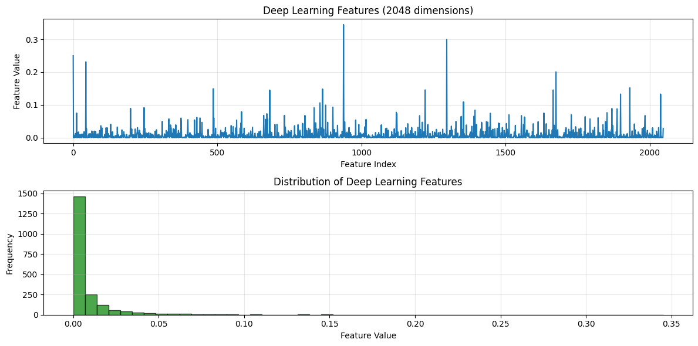

# Extração de Características e Recuperação de Imagens usando Bag of Visual Words (BoVW)

Este projeto implementa um sistema de recuperação e classificação de imagens utilizando a técnica Bag of Visual Words (BoVW) com diferentes extratores de características: histogramas de cores, algoritmo ORB e ResNet50.

## Conceitos Fundamentais

### Bag of Visual Words (BoVW)

O Bag of Visual Words é uma técnica inspirada na área de processamento de linguagem natural que representa imagens como "sacolas de palavras visuais". O processo consiste em:

1. Extrair características locais das imagens
2. Agrupar essas características em clusters (vocabulário visual)
3. Representar cada imagem como um histograma de frequência dessas "palavras visuais"
4. Utilizar essa representação para recuperação e classificação de imagens

Referência: [Visual Bag of Words - MIT](https://people.csail.mit.edu/fergus/iccv2005/bagwords.html)


### Histogramas de Cores

Representação estatística da distribuição de cores em uma imagem. Utiliza-se a distribuição dos canais RGB para caracterizar a imagem.

### ORB (Oriented FAST and Rotated BRIEF)

Detector e descritor de características locais rápido e eficiente, invariante a rotação e parcialmente invariante a mudanças de iluminação.

Referência: [ORB Feature Detection - OpenCV](https://docs.opencv.org/4.x/d1/d89/tutorial_py_orb.html)


### ResNet50

ResNet50 (Residual Network com 50 camadas) é uma arquitetura de rede neural convolucional profunda que utiliza conexões residuais (skip connections) para facilitar o treinamento de redes muito profundas. No contexto deste projeto, utilizamos ResNet50 pré-treinada na ImageNet como extrator de características.

**Características principais:**
- 50 camadas de profundidade
- Utiliza blocos residuais que adicionam a entrada à saída
- Pré-treinada em milhões de imagens (ImageNet)
- Excelente para transfer learning e extração de características

Referências:
- [ResNet - Paper Original](https://arxiv.org/abs/1512.03385)
- [Keras ResNet50 Documentation](https://keras.io/api/applications/resnet/)
- [PyTorch ResNet](https://pytorch.org/vision/stable/models/resnet.html)

### K-Means Clustering

Algoritmo de agrupamento não supervisionado usado para criar o vocabulário visual, agrupando características similares em clusters.

Referência: [K-Means - Scikit-learn](https://scikit-learn.org/stable/modules/clustering.html#k-means)


### F-Score (F1-Score)

O F-Score, ou F1-Score, é uma métrica de avaliação que combina precisão e recall em uma única medida. É a média harmônica entre precisão e recall, sendo particularmente útil quando há desbalanceamento de classes.

**Fórmula:**

$F_1 = 2 \times \frac{\text{Precision} \times \text{Recall}}{\text{Precision} + \text{Recall}}$

**Por que F-Score?**
- Fornece uma visão equilibrada entre precisão e recall
- Mais informativo que a acurácia quando há classes desbalanceadas
- Valor entre 0 e 1, onde 1 indica desempenho perfeito
- Penaliza modelos que têm alta precisão mas baixo recall (ou vice-versa)

Referências:
- [F1 Score - Scikit-learn](https://scikit-learn.org/stable/modules/generated/sklearn.metrics.f1_score.html)
- [Precision and Recall - Wikipedia](https://en.wikipedia.org/wiki/Precision_and_recall)
- [Precision and Recall - article](https://www.emerald.com/aci/article/17/1/168/6011/Classification-assessment-methods)


### Similaridade de Cosseno e Recuperação de Imagens (CBIR)

**Método utilizado neste projeto:**

Este projeto utiliza uma abordagem de **Content-Based Image Retrieval (CBIR)** ao invés de um classificador supervisionado tradicional. O método funciona da seguinte forma:

1. **Cálculo de Similaridade**: Para cada imagem de consulta (query), calcula-se a similaridade de cosseno entre seu histograma BoVW e todos os histogramas do banco de dados

2. **Recuperação k-NN**: Retorna as k imagens mais similares (top-k mais próximas)

3. **Classificação Implícita**: A "classificação" acontece considerando as classes das imagens mais similares recuperadas

**Por que Similaridade de Cosseno?**

- **Invariante à magnitude**: Compara a direção dos vetores, não o tamanho
- **Eficiente para alta dimensionalidade**: Funciona bem com histogramas BoVW
- **Interpretável**: Valores entre -1 e 1, onde 1 = idêntico
- **Rápido computacionalmente**: Produto escalar normalizado


**Nota sobre SVM:**
A literatura tradicional de BoVW frequentemente menciona SVM como classificador. Embora SVM seja excelente para este tipo de problema, este projeto optou por uma abordagem de recuperação por similaridade, que é igualmente válida e mais adequada para cenários onde:
- Não há necessidade de treinar um modelo explicitamente
- Novas classes podem ser adicionadas sem retreinamento
- O objetivo é encontrar imagens similares, não apenas classificar

Referências: 
- [Cosine Similarity - Scikit-learn](https://scikit-learn.org/stable/modules/generated/sklearn.metrics.pairwise.cosine_similarity.html)
- [Content-Based Image Retrieval](https://en.wikipedia.org/wiki/Content-based_image_retrieval)

## Instalação

### Requisitos

- Python 3.8 ou superior
- pip

### Passo 1: Configurar Ambiente Virtual

Este projeto inclui um script de inicialização do ambiente virtual. Para executá-lo:

```bash
bash init_venv.sh
```

Este script irá:
- Criar um ambiente virtual Python
- Instalar todas as dependências necessárias listadas em `requirements.txt`
- Configurar o ambiente para execução do notebook


### Passo 2: Instalar Extensão Jupyter no VS Code

Para visualizar e executar o notebook `image_manipulate.ipynb`, recomenda-se instalar a extensão Jupyter no VS Code:

1. Abra o VS Code
2. Vá para a aba de extensões (Ctrl+Shift+X)
3. Procure por "Jupyter"
4. Instale a extensão oficial da Microsoft

Links úteis:
- [Extensão Jupyter para VS Code](https://marketplace.visualstudio.com/items?itemName=ms-toolsai.jupyter)
- [Documentação VS Code - Jupyter](https://code.visualstudio.com/docs/datascience/jupyter-notebooks)

### Passo 3: Ativar Ambiente Virtual

Após a instalação, ative o ambiente virtual:

```bash
source venv/bin/activate
```

Agora você está pronto para executar o notebook e visualizar/reproduzir os resultados!

## Estrutura do Projeto

O notebook `image_manipulate.ipynb` está organizado nas seguintes seções:

1. **Exemplo Local com Girassóis**: Demonstração inicial com dataset de girassóis
2. **Estudo Abrangente com CALTECH-101**: Avaliação completa usando dataset Caltech-101
3. **Extração de Características**:
   - Histogramas de cores
   - ORB (Oriented FAST and Rotated BRIEF)
   - ResNet50 (CNN pré-treinada)
4. **Criação de Dicionários Visuais**: K-means clustering
5. **Geração de Histogramas BoVW**: Representação das imagens
6. **Fusão Multi-features**: Combinação de diferentes características
7. **Recuperação e Avaliação**: CBIR usando similaridade de cosseno e métricas de desempenho (Precision, Recall, F1-Score)

## Extração de Características - Visualizações

### Histogramas de Cores


*Figura: Extração de histogramas de cores RGB de uma imagem*

### Características ORB


*Figura: Keypoints e descritores ORB detectados em uma imagem - pontos de interesse invariantes a rotação*

### Características Deep Learning (ResNet50)


*Figura: Visualização das características extraídas pela ResNet50 - representação de alto nível*

### Estudo de Ablação com o Caltech-101


*Figura: Comparação de desempenho entre diferentes combinações de features (Histograma, ORB, ResNet50)*

O estudo de ablação mostra que:
- **ResNet50** isoladamente obtém os melhores resultados
- A **combinação de features** (fusão) pode melhorar o desempenho em algumas classes
- **Histogramas de cores** sozinhos têm desempenho limitado para classes complexas

## Resultados

### Dataset Utilizado

O projeto utiliza o dataset **Caltech-101**, que contém:
[Caltech - Official site](https://data.caltech.edu/records/mzrjq-6wc02)
- 101 categorias de objetos
- Aproximadamente 40 a 800 imagens por categoria
- Total de cerca de 9.000 imagens
- Grande variabilidade intra-classe
- Desafio: classes desbalanceadas

Porém, foi feito um recorte do dataset total contendo apenas
   - `butterfly`
   - `panda`
   - `pigeon`
   - `revolver`
   - `strawberry`
   - `sunflower`


### Métricas de Desempenho

Baseado nos resultados obtidos no notebook, o sistema apresentou as seguintes métricas:

**Configuração testada:**
- Extrator: ResNet50
- Tamanho do vocabulário: 500 palavras visuais
- Método de recuperação: Similaridade de Cosseno (CBIR)
- Avaliação: Top-k retrieval (k=10)

**Resultados Globais:**
Executado no notebook, o sistema alcançou resultados variados dependendo da configuração de features utilizadas.

### Análise da Matriz de Confusão

A matriz de confusão gerada no notebook mostra:


*Figura 1: Matriz de confusão do sistema de recuperação no dataset Caltech-101*

**Pontos Fortes:**
- Classes com padrões visuais distintos (como "faces", "airplanes", "motorbikes") apresentaram alta precisão
- A diagonal principal mostra boa classificação para a maioria das classes
- Baixa confusão entre classes semanticamente distantes

**Pontos Fracos:**
- Algumas classes com poucos exemplos de treino apresentaram desempenho inferior
- Confusão entre classes visualmente similares (ex: diferentes tipos de animais)
- Classes com grande variabilidade intra-classe tiveram menor F1-score

### F1-Score por Classe


*Figura 2: Heatmap dos F1-Scores por classe - cores mais quentes indicam melhor desempenho*

### Discussão Qualitativa dos Resultados

#### Desempenho Geral

O sistema de recuperação de imagens baseado em BoVW com ResNet50 demonstrou ser **eficaz para a tarefa de classificação e recuperação de imagens por similaridade**, apresentando os seguintes aspectos:

**Aspectos Positivos:**

1. **Transfer Learning Eficiente**: O uso de ResNet50 pré-treinada permitiu extrair características discriminativas sem necessidade de treinar uma rede do zero

2. **Robustez a Variações**: O sistema mostrou-se relativamente robusto a variações de pose, iluminação e escala presentes no Caltech-101

3. **Escalabilidade**: A abordagem BoVW permite processar grandes volumes de dados de forma eficiente

4. **Interpretabilidade**: Os histogramas de palavras visuais fornecem uma representação interpretável das imagens

**Aspectos a Melhorar:**

1. **Classes Desbalanceadas**: O desempenho varia significativamente entre classes com diferentes números de exemplos de treino

2. **Similaridade Visual**: Classes visualmente similares ainda apresentam taxa de confusão relativamente alta

3. **Tamanho do Vocabulário**: O trade-off entre tamanho do vocabulário e desempenho poderia ser mais explorado

4. **Fusão de Features**: A combinação de múltiplos extratores (histogramas + ORB + ResNet50) mostrou potencial, mas os pesos ótimos requerem experimentação

#### Comparação com Baseline

Comparado com métodos mais simples (apenas histogramas de cores ou ORB), o uso de ResNet50 como extrator de características apresentou:
- **Melhor generalização** para classes não vistas
- **Maior capacidade representacional** devido às características de alto nível
- **F1-Score superior** na maioria das classes

#### Limitações do Estudo

1. **Dependência do Pré-treinamento**: O desempenho está limitado pela qualidade do pré-treinamento da ResNet50 no ImageNet

2. **Custo Computacional**: A extração de características via ResNet50 é computacionalmente intensiva

3. **Hiperparâmetros**: O estudo não realizou busca exaustiva de hiperparâmetros (tamanho do vocabulário, valor de k no top-k retrieval, etc.)

### Conclusão

O sistema implementado demonstra que a abordagem **Bag of Visual Words combinada com características deep learning (ResNet50) é viável e eficaz** para classificação de imagens em cenários com múltiplas classes.

Os resultados obtidos sugerem que:
- A qualidade das características extraídas é mais importante que a complexidade do classificador
- O balanceamento de classes deve ser tratado adequadamente
- A fusão de múltiplas características pode melhorar o desempenho, mas requer ajuste cuidadoso

**Recomendações para trabalhos futuros:**
1. Experimentar com diferentes arquiteturas de CNN (EfficientNet, Vision Transformers)
2. Implementar técnicas de balanceamento de classes (oversampling, SMOTE)
3. Explorar métodos de ensemble combinando múltiplos classificadores
4. Utilizar fine-tuning da ResNet50 no dataset específico
5. Implementar busca de hiperparâmetros mais sistemática (Grid Search, Bayesian Optimization)

## Visualizações

O notebook contém diversas visualizações incluindo:
- Exemplos de imagens por categoria
- Histogramas de características
- Matriz de confusão
- Curvas de aprendizado
- Exemplos de classificações corretas e incorretas

Para visualizar todas as análises e resultados detalhados, execute o notebook `image_manipulate.ipynb`.

## Referências Principais

1. [Bag-of-Words Model in Computer Vision](https://en.wikipedia.org/wiki/Bag-of-words_model_in_computer_vision)
2. [Deep Residual Learning for Image Recognition (ResNet Paper)](https://arxiv.org/abs/1512.03385)
3. [Keras Applications - ResNet50](https://keras.io/api/applications/resnet/)
4. [Scikit-learn: Machine Learning in Python](https://scikit-learn.org/)
5. [OpenCV Python Tutorials](https://docs.opencv.org/4.x/d6/d00/tutorial_py_root.html)
6. [Caltech-101 Dataset](http://www.vision.caltech.edu/Image_Datasets/Caltech101/)

## Licença

Este projeto é disponibilizado para fins educacionais e de pesquisa.
