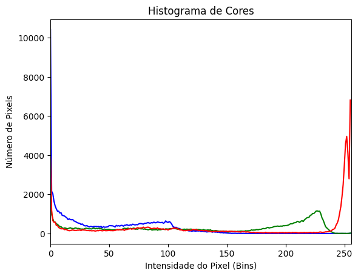
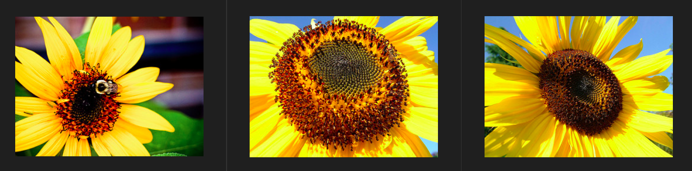

# Image Feature Extraction and Similarity Search

## Introduction

Images are complex data structures composed of millions of pixels, each containing color and intensity information. **Image features** or **characteristics** are distinctive patterns, textures, colors, shapes, or other visual properties that can be extracted from images to represent them in a more compact and meaningful way.

Storing actual images in databases can be extremely resource-intensive due to their large file sizes. A single high-resolution image can easily exceed several megabytes, and a database with thousands of images would require massive storage capacity. Additionally, comparing raw pixel data for similarity searches is computationally expensive and often ineffective.

### Why Store Feature Histograms Instead of Images?

**Storage Efficiency:**
- Raw images: 2-10+ MB per image
- Feature vectors: 256-2048 values (typically 1-8 KB per feature set)
- **99%+ reduction in storage requirements**

**Search Optimization:**
- Pixel-by-pixel comparison: O(n×m) complexity for n×m images
- Feature vector comparison: O(k) complexity where k is vector dimensions
- **Real-time similarity search** vs. minutes/hours for raw image comparison

**Semantic Understanding:**
- Feature extraction captures high-level concepts (colors, textures, objects)
- Enables content-based image retrieval and similarity matching
- Supports applications like reverse image search, recommendation systems

## Dataset

For this project, we selected a curated dataset of **51 sunflower images** as an example case study. This focused dataset allows us to demonstrate the effectiveness of different feature extraction methods while maintaining manageable computational requirements for development and testing.

**Dataset Credits:**
- **Source:** Kaggle Flowers Dataset
- **Original Collection:** https://www.kaggle.com/datasets/imsparsh/flowers-dataset
- **License:** CC0: Public Domain
- **Flower Type:** Sunflowers only (subset of the full dataset)

## Feature Extraction Methods

This project implements three complementary approaches to image feature extraction:

### 1. Color Histogram Features
Using OpenCV's `cv2.calcHist()` function, we compute normalized color histograms for each image across the RGB color channels using an **8×8×8 bin configuration**. This creates a compact 512-dimensional feature vector (8 bins per channel × 3 color channels) that captures the essential color distribution while reducing computational complexity.

**Why 8×8×8 bins instead of 256?**
- **Dimensionality reduction:** 512 features vs 768 features (256×3)
- **Noise reduction:** Fewer bins are less sensitive to minor color variations
- **Computational efficiency:** Faster similarity comparisons and storage
- **Retained discriminatory power:** Still captures essential color characteristics for sunflower classification

```python
# Example: Color histogram calculation with 8×8×8 bins
hist_b = cv2.calcHist([image], [0], None, [8], [0, 256])    # Blue channel
hist_g = cv2.calcHist([image], [1], None, [8], [0, 256])    # Green channel
hist_r = cv2.calcHist([image], [2], None, [8], [0, 256])    # Red channel
```

**Reference:** https://docs.opencv.org/4.x/d1/db7/tutorial_py_histogram_begins.html

### 2. ORB (Oriented FAST and Rotated BRIEF) Features
ORB features provide robust keypoint detection and description for object recognition and image matching. Unlike more computationally expensive methods like SIFT or SURF, ORB offers an excellent balance of performance and efficiency.

```python
# Example: ORB feature detection
orb = cv2.ORB_create(nfeatures=500)
keypoints, descriptors = orb.detectAndCompute(image, None)
```

**Why ORB with 500 maximum features?**
- **Optimal balance:** Enough features for robust matching without excessive computation
- **Memory efficiency:** Reduces storage requirements for feature descriptors
- **Processing speed:** Faster feature extraction compared to higher feature counts
- **Sufficient discriminatory power:** 500 features provide excellent matching accuracy for sunflower images

**Reference:** https://docs.opencv.org/4.x/d1/d89/tutorial_py_orb.html

### 3. ResNet50 Deep Learning Features
We utilize a pre-trained ResNet50 model from TensorFlow/Keras to extract high-level semantic features. ResNet50 processes normalized images and generates 2048-dimensional feature vectors that capture complex object characteristics and semantic meaning.

```python
# Example: ResNet50 feature extraction
model = ResNet50(weights='imagenet', include_top=False, pooling='avg')
features = model.predict(preprocessed_image)
```

**Why ResNet50?**
- **Pre-trained on ImageNet:** 1.4M images, 1000+ object categories
- **Deep residual learning:** Overcomes vanishing gradient problems
- **Proven performance:** State-of-the-art results on multiple benchmarks
- **Transfer learning benefits:** Leverages knowledge from massive dataset

**Model Credits:** https://www.ultralytics.com/blog/what-is-resnet-50-and-what-is-its-relevance-in-computer-vision

## Example Visualizations

**Figure 1: Original sunflower image**


**Figures 2-4: Feature visualizations for the same image**

| Color Histogram | ORB Keypoints | ResNet50 Features |
|----------------|---------------|-------------------|
|  |  |  |

*Figure 2-4: Comparison of feature extraction methods - color distribution (left), local keypoints (center), and deep semantic features (right)*

## Implementation

The Python notebook `image_manipulate.ipynb` processes the entire dataset of 51 sunflower images and creates three feature dictionaries:

1. **`color_features_dict`**: Normalized RGB histograms for each image
2. **`orb_features_dict`**: ORB descriptors and keypoints
3. **`resnet_features_dict`**: 2048-dimensional semantic feature vectors

## Results

We evaluated each method by processing the first (`4746638094_f5336788a0_n.jpg`) and last (`5957007921_62333981d2_n.jpg`) images from our dataset, finding the 10 most similar images for each method.

**Figure 5: Similarity results using color histogram method**

*Top 3 from Top 10 most similar sunflowers based on color distribution analysis*

**Figure 6: Similarity results using ORB features**

*Top 3 from Top 10 most similar sunflowers based on local feature matching*

**Figure 7: Similarity results using deep learning features**

*Top 3 from Top 10 most similar sunflowers based on semantic feature analysis*


## Installation and Usage

### Prerequisites
- Python 3.8+
- Git
- Virtual environment support

### Setup Instructions

1. **Clone the repository:**
```bash
git clone git@github.com:LucasDuarte026/image_dict_histogram.git
cd image_dict_histogram
```

2. **Create and activate virtual environment:**
```bash
python -m venv venv
source venv/bin/activate  
```

3. **Install dependencies:**
```bash
pip install -r requirements.txt
```

4. **Run the analysis:**

   - Can be in `VSCode` extension also
```bash
jupyter notebook image_manipulate.ipynb
```

## Project Structure

```
image_dict_histogram/
├── dataset_sunflowers/     # 51 sunflower images
├── images/                # Generated visualizations
├── image_manipulate.ipynb # Main analysis notebook
├── requirements.txt       # Python dependencies
└── readme.md             # This file
```

## License

This project is licensed under the **MIT License** - see the LICENSE file for details.


*For questions or contributions, please open an issue or submit a pull request on GitHub.*


## 📌 Author

This project is part of the **SCC0661 - Multimedia and Hypermedia** course at **University of São Paulo (USP)**.


Lucas Sales Duarte  
NUSP: 11734490  
Discipline: <b>SSC-715-2016 – USP São Carlos</b>

